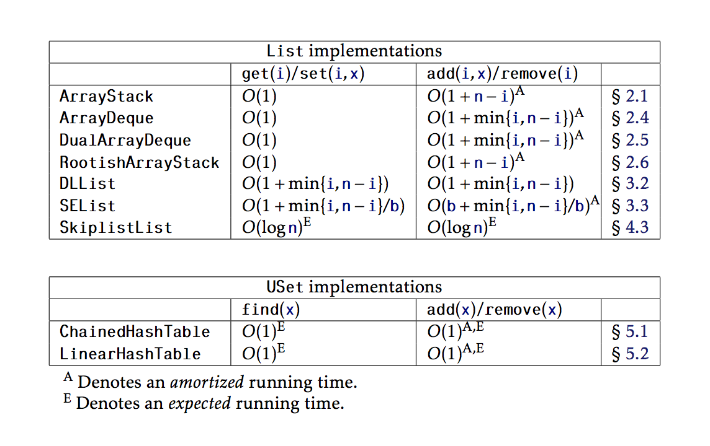
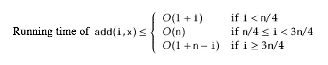
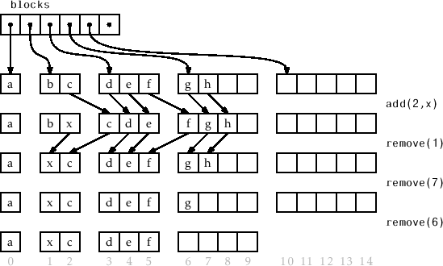
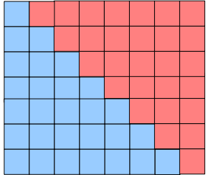
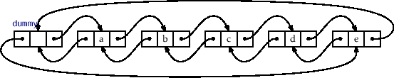

<div>
<h1>Exam Review Part 1</h1>

**Textbook can be found <a href='http://opendatastructures.org/' target='_blank'>here</a>.**

**Questions can be found here:**

http://cglab.ca/~morin/teaching/2402/notes/questions.pdf<br/>
http://cglab.ca/~morin/teaching/2402/notes/questions2.pdf

<h2>Runtimes</h2>
<br/>


<h2>Java Collections Framework</h2>
<h3>Interfaces</h3>
1.
A Set is an interface for a data structure that only allows for unique elements, in an unordered collection of said type of elements.
A List is an ordered collection capable of storing duplicate elements.

2. 
The collection interface stores a collection of values, each element stored at a specific index of the data structure. Map’s store their values at a given key. Each entry has a key associated with a value that is used to lookup it’s value.

3. 
Storing students merely for the purpose of checking if the data structure contains a Student would be best suited for the Set Interface.

4. 
Having an ordered, quick to find structure would be the SortedSet interface

5. 
**Information associated with each student? **

Use a SortedMap

6.
Two ways to accomplish a bag would be through:
<br/>
<code>new Bag \<Integer, T\>()</code><br/>
Integer states how many time the element is repeated.

**or**<br/>
	
<code>new Bag \<T, ArrayList\<T>()\>() </code>


ArrayList<T> would contain the amount of duplicate elements.

7. 
Iterator is only capable of searching forward and removing elements.

The list iterator can also do add, set, and iterate backwards.

<h3>Implementations</h3>

1.
Modifying the <code>equals</code> method can have serious implications on how the Set stores data.
The set interface is actually uses the Map Interface. That's how it's able to do lookup's so quickly.

You take the given value, you convert it to a key using <code>hashCode</code> function and the set uses this hashcode
to check if it contains said element.

**Benefits of a <code>LinkedHashSet</code> over a <code>HashSet</code>?**

The LHS has all the benefits of a HashSet, being able to do quick lookups, and store unique values. 
But the LinkedList in it also allows it to maintain order of entry.

**Running time of <code>get(i) && set(i,x)</code> for an ArrayList vs. a LinkedList?**

get:
ArrayList: O(1). Just return the value at the array's index.
LinkedList: 

For a doubly linked list, you'd be able to iterate backwords.
Therefore, <code>O(min(i, n-i) + 1)</code>

As for a SL List, <code>O(1+i)</code> is your only option

set:
see get ^

4. 
<code>add(i,x)</code>

An arraylist, in worst case would have to resize to make room, them shift all elements ahead of it to make room,
and then it would be able to place the element.
This works out to <code>O(1 + n - i)<sup>A</sup></code>

<sup>A</sup> denotes Amortized. Meaning this ignores the cost to resize.

```
	DLL: O(1 + min(i, n-i))

	SLL: O(1 + i)
```

5. 

Time complexity in a linked list is essentially just setting the cursor's position.

Once you've navigated, say to element n/2, there's no problem to add elements there.

For an ArrayList, adding to the middle will require O(1 + n - n/2) operations per <code>add</code> operation.

<h2>Lists as Arrays</h2>
Questions about the List Interface

<h3>ArrayStacks</h3>
1.
<a href='#runtimes'>Runtime Complexity of <code>get</code> and <code>set</code></a>
ArrayStacks are essentially just Arrays with bells and whistles. 
2.
ArrayStacks resize when:

<code>n+1 > a.length</code><br/>
The reason that we resize the ArrayStack to be double it's previous size, as opposed to just 1 or a constant
is to find a good balance between the time complexity required to resize the structure, and the space complexity
of storing the elements without excessively wasting memory.

3. 
If you are currently growing the backing array, then the number of add and remove operations...


**Lemma 2.1**  If an empty ArrayStack is created and any sequence of 'm' calls to <code>add(i,x)</code> and <code>remove(i)</code> are performed, then the total time spent during all calls to  <code>resize</code>is <code>O(m)</code>

The amortized time for add and rmeove as a product of <code>i</code><sub>calls to resize</sub> is
<code>n<sub>i</sub>/2-1</code>

<h3>ArrayDeques</h3>
For FIFO, the ArrayStack is a poor implementation

Stimulates an infinite array

<code>int j</code> keeps track of the next element to remove

<code>int n</code> indicates the number of elements

The cursor lets us quickly perform resize operations. But the problem is indexing.

Using modular arithemetic, we're able to make pretend that our array is actually infinite, by overwriting null elements after a resize.

This looks something like this:

<code>a[(j+i) % a.length]</code>

To ensure we don't surpass the length of the array.


**Describe, in words, how to perform an add(i,x) operation (a) if i < n/2 and (b) if i >= n/2**


```
	if (i < n/2) {// shift a[0],..,a[i-1] left one position
	
		j = (j == 0) ? a.length - 1 : j - 1; //(j-1) mod a.length
	
		for (int k = 0; k <= i-1; k++)
			a[j+k] = a[j+k+1];
		
	} else { // shift a[i],..,a[n-1] right one position

		for (int k = n; k > i; k--)
	
			a[j+k] = a[j+k-1];
		
	}
```

Case 1: i < n/2

This is code I took from ArrayDeque2. It simulates modular arithmetic. If our cursor is pointing at 0,
we're intended to loop to the back. Otherwise we decrement it.

Case 2: i >= n/2

Set each value of a to be its the element before it. Which essentially shifts all the elements right.

**Running time of add(i,x) and remove(i)**

O(1+min(i,n-1)) for each operation

**Why can't we use <code>System.arraycopy()</code>**

Because the cursor! We can't perform the same sort of looping arithmitic with that function.

**Explain why, using an example, if a.length is a power of 2 then <code>(x mod a.length) == (x & (a.length-1))</code>. Why is this relevant when discussing ArrayDeques**

Lets work it out

When a.length is not a power of two:
x=5

a.length = 3

Mod:
5%3 = 2

And Operation:

	  00000101
	& 00000010 (we subtracted 1)
	----------
	  00000000 WRONG

Now when a.length is a power of two:

x=5

a.length = 2

Mod:
5%2 = 1

And Operation:

	  00000101
	& 00000001 (we subtracted 1)
	----------
	  00000001 ! correct

That's it. It's mathematically sound. Prove me wrong!

For more info on this optimization, see this <a href='http://blog.teamleadnet.com/2012/07/faster-division-and-modulo-operation.html' target='_blank'>**article**</a>

<h3>DualArrayDeques</h3>
Benefits over a ArrayDeque?

*none*

*How are elements<sub>{1..n-1}</sub> distributed?*

First, add determines if the index is within the bounds
```
   void add(int i, T x) {
        if (i < front.size()) { 
            front.add(front.size()-i, x);
        } else {
            back.add(i-front.size(), x);
        }
        balance();
    }
```
<code>Balance</code> balances the front deque, and the back deque to ensure the elements are evenly
distributed. It ensures that there are at least <code>n/2</code> elements in each deque.

```
 void balance() {
        int n = size();
        if (3*front.size() < back.size()) {
            int s = n/2 - front.size();
            List<T> l1 = newStack();
            List<T> l2 = newStack();
            l1.addAll(back.subList(0,s));
            Collections.reverse(l1);
            l1.addAll(front);
            l2.addAll(back.subList(s, back.size()));
            front = l1;
            back = l2;
        } else if (3*back.size() < front.size()) {
            int s = front.size() - n/2;
            List<T> l1 = newStack();
            List<T> l2 = newStack();
            l1.addAll(front.subList(s, front.size()));
            l2.addAll(front.subList(0, s));
            Collections.reverse(l2);
            l2.addAll(back);
            front = l1;
            back = l2;
        }
    }
```
Because of this our runtime's become more complicated. They can be broken down into three cases.



<strong>
Recall that we rebalance the elements among front and back when front.size() x 3 < back.size()
or vice versa. After we rebalance, we have front.size() == back.size() ± 1. What does this
tell us about the number of add() and remove() operations between two consecutive rebalancing
operations. (See page 39 of <a href='http://cglab.ca/~morin/teaching/2402/notes/arrays-ii.pdf' target='_blank'>arrays-ii.pdf</a>).
</strong>

There are **at least <code>n/2-1</code>** add or remove operations per balance.

This also proves that the total time spent rebalancing is <code>O(m<sub>(number of calls to add and remove)</sub>)</code>

<h3>RootishArrayStacks</h3>
More information <a href='http://cglab.ca/~morin/teaching/2402/notes/arrays-iii.pdf' target='_blank'>here</a>

Benefits:
<ul>
<li>constant time get and set</li>
<li>add and remove in linear time</li>
<li>space complexity of <code>O(size<sup>1/2</sup></code>!</li>
</ul>

A list that contains **blocks**. Each block is an array, **size being it's corresponding index** in the
sequence of blocks.



**. If a RootishArrayStack has r blocks, then how many elements can it store?**

```
	let:
		n = number of elements
		r = number of blocks
 	n => [r * (r + 1)] / 2
 
```

As seen here in this image,



**How can we get a specific index?**

Index i doesn't translate to a position inside a block, so we use this:

```
	int b 	  = 1/2 * (-3 + (9+8i)^1/2)
	
	int index = i - b * (b+1)/2
```

**If a RootishArrayStack contains n elements what is the amount of wasted space?**

<code>remove(i)</code> ensures that there are never more than **two blocks** that are not completely full.

Therefore this struture would satisfy the following equality:

```
	Let:
	
	 r = number of blocks
	 
	 n = number of elements
	
	    (r-2)(r-1) <= n
	->  r^2 -3r + 2 <= n
	->  r <= (3 + (1+4n)^1/2) / 2
	->  r <= O(n^1/2)
```

Therefore the total amount of space wasted is at most <code>O(n<sup>1/2</sup>)</code>

<h3>LinkedLists</h3>

<h4>Singly-Linked Lists</h4>
Self explanatory. Won't go into it too much.

** How quickly can we find the ith node in an SLList?**

At fastest O(i+1)

** Explain why we can’t have an efficient implementation of a Deque as an SLList.**

Because SLL can only iterate from the beginning, and deques perform operations on the back.


<h4>Doubly-Linked Lists</h4>

These are the **default implementation of LinkedLists** in Java

**Purpose of a dummy node?**

Quick access to both the head and the tail.

```
	dummy.next = head
	dummy.prev = tail
	
```



**Which method is correct?**

```
	protected Node add(Node u, Node p) {
		u.next = p;
		u.prev = p.prev;
		u.next.prev = u;
		u.prev.next = u;
		n++;
		return u;
	}
	protected Node add(Node u, Node p) {
		u.next = p;
		u.next.prev = u;
		u.prev = p.prev;
		u.prev.next = u;
		n++;
		return u;
	}
```


	u.next.prev = u
	u.prev = p.prev
	
At this point, in the second method, we've set u's previous to be itself.

Therefore the first method is correct.

**Runtime of <code>add</code> and <code>remove</code>?**

Actually adding and removing the elements is constant time. The struggle is in getting there.

Which takes:

	O(1 + min{1,n-i})
	
<h4>Memory Efficient Doubly-Linked Lists</h4>

Linked list but each node is a fixed size array of elements.

```
	get(i), set(i,x)    == O(1+min{i,n-i}/b)
	add(i,x), remove(i) == O(b+min(i,n-i}/b)
```

The **space complexity** is measured to be <code>n + O(b + n/b)</code>

Where b represents the block size, and n is the number of elements.

**Wasted Space?**

At most <code>O(b+n/b)</code> space wasted.

<h3>Hash Tables</h3>
<code>hash(x) = ( (x.hashCode() · z) mod 2<sup>w</sup>) div 2<sup>w−d</sup></code>
	
<strong>If we place n distinct elements into a hash table of size m using a good hash function, how many
elements do we expect to find in each table position?</strong>

This phenomenon can be described through **Direchlet's box**, also known as the <a href='http://en.wikipedia.org/wiki/Pigeonhole_principle' target='_blank'>Pidgeonhole Principle</a>

<a href='http://blog.codinghorror.com/hashtables-pigeonholes-and-birthdays/' target='_blank'>Here's</a> a good article that breaks it down even further.

**Recall the multiplicative hash function hash(x) = (x.hashCode() * z) >>> w-d.**

**In 32 bit Java, what is the value of <code>w</code>**

32

<strong>How large is the table that is used with this hash function? (In other words, what is the range of
this hash function?)</strong>

<code>{0..2<sup>w</sup>-1}</code>

**Explain the relationship between an class’ hashCode() method and its equals(o) method.**

**Hashcode** is used to append to the **position in the hash table.**

ex. <code>table[hash(x)].append(x)</code>

**Equals** is used to compare every element that falls under that address.

ex.
```
table[hash(x)] = [1,2,3]
table.get(1) --> table[hash(1)].find(1) [iterates through all elements at this location]
```

**What's wrong with this hashCode function?**

	public class Point2D {
		Double x, y;
		...
		public int hashCode() {
			return x.hashCode() ^ y.hashCode();
		}
	}
	
XOR has a lot of benefits when hashing, but this situation wouldn't highlight those.

For more info on hashing and specifically bitwise XOR hash, click <a href='http://mindprod.com/jgloss/hashcode.html' target='_blank'>here</a>

From that site:

	It ignores order. A ^ B is the same a B ^ A. If order matters, you want some sort of checksum/digest such 	as Adlerian. XOR would not be suitable to compute the hashCode for a List which depends on the order of the 	elements as part of its identity.

So with something like 2D points, it definitely matters. Because **(0,5) is not the same thing as (5,0)**
