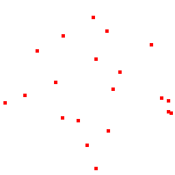
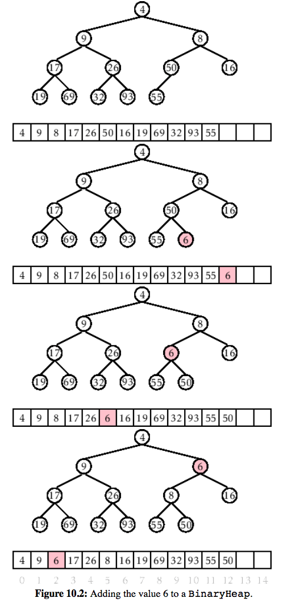
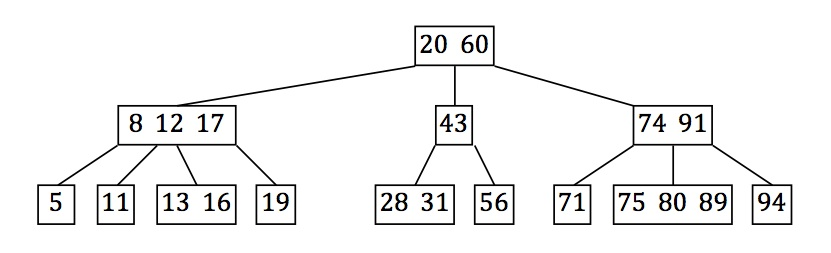

<h1>Exam Review Part 2</h1>

**Textbook can be found <a href='http://opendatastructures.org/' target='_blank'>here</a>.**

**Questions can be found here:**

http://cglab.ca/~morin/teaching/2402/notes/questions.pdf 
http://cglab.ca/~morin/teaching/2402/notes/questions2.pdf

##SkipLists
SkipList is a data structure that uses <code>Random.nextBoolean()</code> to determine whether
to create a new list level or just append to the current one.

This image from wikipedia well depicts the process of adding / finding elements

<strong>Explain how the reverse search path is related to the following experiment: Toss a coin
repeatedly until the first time the coin comes up heads</strong>

It's related in the sense that the number of coin flips before the coin lands heads
determines the number of nodes that the reverse search path visits.

<i>
The number of nodes that the reverse search path visits at a particular level, `r`, is related to the following experiment: Toss a coin. If the coin comes up as heads, then move up and stop. Otherwise, move left and repeat the experiment. The number of coin tosses before the heads represents the number of steps to the left that a reverse search path takes at a particular level.4.3 Lemma 4.2 tells us that the expected number of coin tosses before the first heads is 1.
</i>

<strong> If there are n elements in L0, what is the expected number of elements in L1? What
about in Li?</strong>

Li expects to have <code>i/2i</code>

After each coin flip, the probability of increasing the level becomes smaller and smaller.

<strong>If there are n elements in L0, give an upper bound on the expected length of the search
path for any particular element.</strong>

Lemma 4..6   The expected length of a search path in a skiplist is **at most**:

  2logn + O(1)
  
<strong> Explain, briefly, how a skiplist can be used to implement the SortedSet interface.
What are the running times of operations <code>add(x), remove(x), contains(x)</code>?</strong>

Skiplists, when adding or searching for an element check to see, starting from the highest level,
if what it's searching for is greater or less than that element.

All these operations should take an expected time of <code>O(logn)</code>

##Big-Oh Notation

1. __What is O(n)? What kind of object is it?__

Big Oh is a set of functions that includes every function `g(n)` if `c>0` and no n0 exists such that `g(n) <= c * f(n) for all n >= n0`
 
2. __What does the statement <code>2n + 3 = O(n2)</code> mean?__

It means that the function fits under the upper bound of n2. Which is true for a certain n0

3. Recall the basic Big-O...

2n2 should be after O(logn), 100nlogn would also be after O(logn). Actually so would (logn)3. All in the middle, I believe.

##Convex Hulls

A *Convex Hull* can be described as the smallest *convext set* of a set of points

An __upper hull__ is the part of the convex hull, which is visible from the above. It runs from its rightmost point to the leftmost point in counterclockwise order. __Lower hull__ is the remaining part of the convex hull.

The **Graham Scan**

1. Find the lowest y-coordinate, and if more than 1 find lowest x as well. `O(n)` just to find smallest point.
2. Sort the set of points in **increasing order** of the **angle** they make with your point `P`. Need a general purpose sorting algorithm like **heap sort**.
3. **Avoids one direction of turns**. If we begin rightwards, we try to maintain **only turning right**. If we can't we move on to the next point.

Time Complexity:

`O(nlogn)`

##Binary Trees and Binary Search Trees

###[Traversal Algorithms](http://en.wikipedia.org/wiki/Tree_traversal)

__Pre-order__

1. __Display the data part of the root element (or the current element)__
2. Traverse the left subtree by recursively calling the preorder function
3. Traverse the right subtree by recursively calling the pre-order function

		preorder(node)
			  if node == null then return
			  visit(node)
			  preorder(node.left) 
			  preorder(node.right)
		======================
		iterativePreorder(node)
  			parentStack = empty stack
  			
  			
		  	while (not parentStack.isEmpty() or node ≠ null)
		    if (node ≠ null) 
		      visit(node)
		      if (node.right ≠ null) parentStack.push(node.right) 
		      node = node.left   
		    else     
		      node = parentStack.pop()	
		      
Once it can't go left any more, it will use the most recent right node and repeat that same proces.

__In-Order__

1. Traverse the left subtree recursively
2. __Display the data part of the current element__
3. Traverse the right subtree recursively

		inorder(node)
		  if node == null then return
		  inorder(node.left)
		  visit(node)
		  inorder(node.right)
		 =================
		 iterativeInorder(node)
		  parentStack = empty stack
		  while (not parentStack.isEmpty() or node ≠ null)
		    if (node ≠ null)
		      parentStack.push(node)
		      node = node.left
		    else
		      node = parentStack.pop()
		      visit(node)
		      node = node.right

__Post-Order__

1. Traverse left recursively
2. Traverse right recursively
3. Visit current node

		postorder(node)
		  if node == null then return
		  postorder(node.left)
		  postorder(node.right)
		  visit(node)

###Binary Search Trees

Has the __binary search tree property__. 

For every node, `u`, every data value stored in the subtree at `u.left` is less than `u.value`, and vice versa for the right side.

`add` iterates to the bottom of the tree via this search algorithm, and inserts the node on the right or left of __bottom most__ node.

	Node findLast(T x) {
   		Node w = r, prev = nil;
   		while (w != nil) {
    		prev = w;
    		int comp = compare(x, w.x);
    		if (comp < 0) {
      			w = w.left;
    		} else if (comp > 0) {
      			w = w.right;
    		} else {
				return w; }
		}
  		return prev;
	}
	
`remove(Node u)`

Find the smallest node in `u`, so the left most node inside of `u.right`, and set `u=thatNode;` and set `thatNode.parent.left=null` to avoid future problems.

`add`, `remove`, and `find` can all execute in `O(n) time`. This data structure implements the `SSet Interface`. 

An easy way to show that this will be `O(n)` worst case:

`for (int i = 0 ; i < 10_000 && bst.add(new Node(i) ; i++);`

Will be a long chain of right nodes only.

The main problem with this dat structure is it can become __unbalanced__.

__Can other permutations of the same tree exist?__

Nope.

__Relationship between quicksort and BinarySearchTree's__

`quicksort` is a search algorithm that works as follows:

1. Grab a random index
2. Compare every element against that to put it on the left most end or the right most end.
3. Repeat this process recursively with `a[0:n/2]` and `a[n/2:n]`.

Worst case: `O(n^2)`

Average case: `O(nlog(n))`

The relationship between the two is as follows:

__Quicksort__ sorts via comparisons, __BinarySearchTrees__ insert, remove and find via comparisons.

Both sort using comparisons.

##Treaps

Follow both __heap__ and __BST__ properties.

Identical to the structure of a BST. pg.160

__Heap Property__

All nodes __priorities__ are __less than__ each of its __children__, according to a comparison predicate defined for the heap.

**Relationship between RBST and Treap**

Both follow the **heap property** 

**Relationship between insertion and deletion**

Rotations. As well as expected time. `O(logN)`

Rotations are performed to maintain the total depth of the tree.

On `add`ition, if our Node `u`'s is __added as the right child__, we perform a `rotateLeft(u.parent);`, and if __added as a left child__, we `rotateRight(u.parent);`. This process is known as `bubbleUp(Node u)` and we perform it, starting from the __bottom__ until one of two __conditions are met__:

1. `u.parent == null`
2. `u.parent.value <= u.p`

`remove(x)`

Actually the opposite of addition.

Steps:

1. Search for a node `u` with a priority of `x`
2. On finding it, we rotate to move `u` to the bottom until it becomes a leaf (no children)
 
	__Cases__
		
		1. No children, remove element
		2. Left child is null, go right (rotateLeft)
		3. Right child is null, go left. (rotateRight)
		4. Both children exist
			1. Right priority is greater than left, go left (rotateRight)
			2. Left priority is greater than right, go right (rotateLeft).

Treap implements __SSet Interface__. Supports all of its operations at `O(logN)` expected time.

In a Treap, the __expected search path length__ is:

`2ln(n) + O(1)`

versus the SkipList:

`2log(n)`

##Scapegoat Trees

A Binary Search Tree with Partial Rebuilding

Keeps itself balanced by __partial rebuilding operations__. This is where an entire __sub__tree is reconstructed and rebuild into a perfectly balanced tree.

At all times

	q = counter,
		 maintains upper bound
	n = number of nodes
	
	q/2 <= n <= q
	
	The ScapeGoat property
	
	size(w.child)/size(w) > 2/3
	
	Which translates to, make sure
	that each child doesn't have 
	too many children.
	
	If there exists a scapegoat
	node, we restructure it's
	entire subtree.
	
__Why do we keep two counters?__

To prevent resizing too often. 

`add` and `remove` take an amortized time of:

`O(log(n))`	

Rebuilding takes at most:
`O(size(w))`

Where `w` is the scapegoat node.

From an empty ScapeGoatTree, a sequence `m` of `add(x)` and `remove(x)` operations, results in `O(mlog(m))` time spent during calls to __rebuild__.

##Heaps

__Eytzinger's Method__

Allows us to represent complete binary trees as an array, by laying the noes out in __breadth-first order)).

Both `add` and `remove` take `O(log(n))`

`add(u)` will set the last element in the array to be `u`, and sort it by use of `bubbleUp`, which will `swap` nodes based on their __value__.

	boolean add(T x) {
   		if (n + 1 > a.length)
   		resize();
  	 	a[n++] = x;
   		bubbleUp(n-1);
   		return true;
 	}
 	void bubbleUp(int i) {
   		int p = parent(i);
   		while (i > 0 && compare(a[i], a[p]) < 0) {
    		swap(i,p);
     		i = p;
     		p = parent(i);
		} 
	}
`remove` will:
	
	1. Pop the top element and swap with last
	2. Push last down through rotations
	until it's as far as it can go (while maintaining heap prop.)
	
A __BinaryHeap__ implements the __(priority) Queue interface.__
Ignoring the cost of calls to resize(), a BinaryHeap supports the operations __add(x)__ and __remove()__ in __O(logn) time per operation__.

###Heap Sort

Comparison based sorting algorithm, 

 	<T> void sort(T[] a, Comparator<T> c) {
   		BinaryHeap<T> h = new BinaryHeap<T>(a, c);
   		while (h.n > 1) //h.n = a.length
     		h.swap(--h.n, 0);
     		h.trickleDown(0);
   		}
   		Collections.reverse(Arrays.asList(a));
 	}
Swaps the last element with the first, and trickles it down as far as it can **while maintaining heap property**

The __heapSort(a,c)__ method runs in `O(nlogn)` time and performs at most `2n log n + O(n)` comparisons.

##Randomized Meldable Heaps
`add(x)` and `remove()` are implemented in `merge(h1,h2)`.

Compares nodes recursively until it finds a node where h2 is less than h1. And sets h2's parent to be h1. Or vice versa.

	Node<T> merge(Node<T> h1, Node<T> h2) {
		if (h1 == nil) return h2;
		if (h2 == nil) return h1;
   		if (compare(h2.x, h1.x) < 	0) return merge(h2, h1);
   		// now we know h1.x <= h2.x
   		if (rand.nextBoolean()) {
     	
   			h1.left = merge(h1.left, h2);
     		h1.left.parent = h1;
   		} else {
     		h1.right = merge(h1.right, h2);
     		h1.right.parent = h1;
   		}
		return h1; 
	}
	
##Sorting

<table class="tg">
  <tr>
    <th class="tg-031e">Algorithm</th>
    <th class="tg-031e">Comparisons</th>
    <th class="tg-031e">Running Time</th>
    <th class="tg-031e">Auxiliary Space Complexity</th>
  </tr>
  <tr>
    <td class="tg-031e">mergesort</td>
    <td class="tg-huad">At most nlogn</td>
    <td class="tg-031e">O(nlogn)</td>
    <td class="tg-031e">O(n)</td>
  </tr>
  <tr>
    <td class="tg-031e">quickSort</td>
    <td class="tg-031e">At most 2n*ln(n) + O(n)</td>
    <td class="tg-031e">O(nlogn)</td>
    <td class="tg-031e">O(n)</td>
  </tr>
  <tr>
    <td class="tg-031e">heapSort</td>
    <td class="tg-031e">At most 2nlogn + O(n)</td>
    <td class="tg-031e">O(nlogn)</td>
    <td class="tg-031e">O(1)</td>
  </tr>
</table>

###Merge Sort

Classic divide and conquer recursive algorithm. We split our input array into **two halves**. Recursively sort each, and merge with other half, and then merge this sorted half with the other sorted half.

###Quick Sort

Divide and conquer as well. Choose a **pivot**, append each item **less than** or greater to the **start, minus the elements that have been already placed there**, or the **end, less the elements** thrown there as well. Then **recursively** repeat this process on each half of the supplied array parameter, until you cannot split it further.

###Heap Sort

Converts the input array into a **heap**, and repeatedly swaps the last element with the first, and **trickles down** the first element as far as it can go, while maintaining the heap property. As it does this, it **decrements** a counter for the size of the array, and once the counter is equal to **one**, we stop the process, and **flip our collection**.

See **Binary Heap** for a more indepth explanation of the `trickleDown` algorithm

##Plane Sweep

###Bentley-Ottmann's Line Sweep Algorithm

For more details, check out [Michiel Smid's Paper](http://people.scs.carleton.ca/~michiel/lecturenotes/ALGGEOM/bentley-ottmann.pdf) (Pg. 4)

As well as this article:

[Bentley-Otmann Algorithm](http://www.eleves.ens.fr/home/cagne/internship_l3/mncubes_red/doc/html/index.html)

Lists all crossings in a set of line segments, based on *Shamos-Hoey's Algorithm*, by scanning the plane with a line, `L`, that compares end points against line segments to find intersections.

Time Complexity:

 `O((n+k)*logn)`

Space Complexity:

`O(n)`

Maintains two data structures:

1. Binary Search Tree
	- Contains the set of input line segments that cross our **sweep line**
2. Priority Queue

###Events
During our sweep process, both the **endpoints** of the lines in the set as well as the **intersection points** are refered to as **events**.

**Endpoint Events**

1. **Left endpoint** is now a potential intersection
2. **Right endpoint** means we forget about this line.

**Intersection Events**

1. Compute the intersection, and move on.

##2-4 and Red-Black Trees

###2-4 Trees

 
Properties

1. All leaves have the same depth
2. Every internal node has 2,3, or 4 children
	- This property implies that the height is **logarithmic** in the number of leaves.
	- Tree with `n` leaves has height at most of `log(n)`

Each node can contain 1, 2, or 3 values.

Each of the childrens positions must fit into the bounds of the other values that the node contains. So The number of values a node contains determines the number of children it will have.

###RedBlack Trees

No red on red, or black on black action. 

- Root must be black.
- Every red node must have two black children
- NIL can touch black

Therefore, we have a stimulated `2-4 tree`.

A black node with the following children:
		
		two red = four children
		one red, one black (NIL) = 3 children
		two black = two children
		

